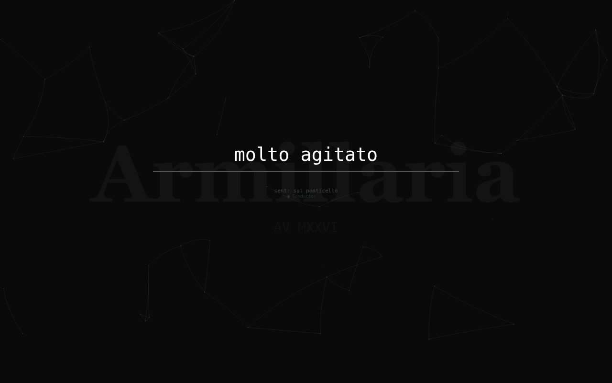
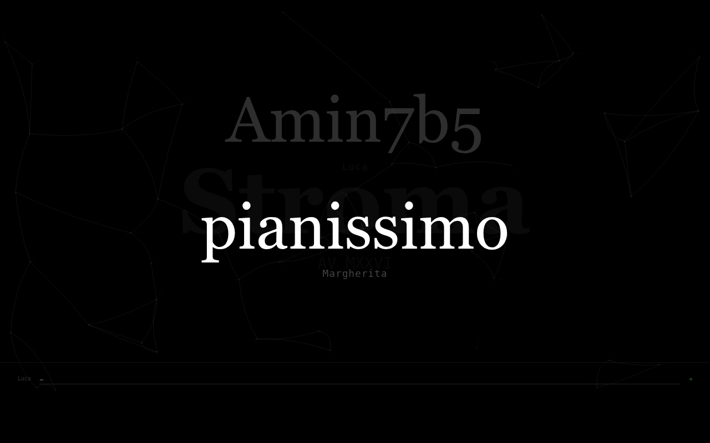

# Armillaria

A minimal system for sending real-time instructions to musicians during performance.

One sender types. Any number of receivers display. Instructions can be addressed to everyone or to a specific musician by name. No apps, no accounts — musicians just open a URL in a browser.

---

## Screenshots

**Armillaria — name prompt**


**Armillaria — receiver displaying an instruction**


**Armillaria — sender composing**



**Stroma — node with message history**



---

## How it works

The sender types an instruction and presses Enter. It appears instantly on all connected receiver screens. If the instruction starts with a name followed by a colon, only that musician's screen shows it. Everything else is shared by all.

```
pianissimo           →  everyone sees it
Saxophone: solo      →  only the Saxophone screen shows it
Amin7b5              →  everyone sees it
molto agitato        →  everyone sees it
```

---

## Files

**Armillaria** (hierarchical — one or more senders, any number of receivers):
```
armillaria/
├── server.py        ← WebSocket server (relay, supports multiple named senders)
├── sender.html      ← Sender interface (the kybernete)
└── receiver.html    ← Musician interface
```

**Stroma** (flat — all nodes equal, everyone sends and receives):
```
armillaria/
├── stroma_server.py ← WebSocket server (broadcasts to all nodes)
└── node.html        ← Node interface (input + display on one page)
```

---

## Requirements

Python 3.8+ and the `websockets` library.

```bash
pip install websockets
```

If you are using a virtual environment (recommended):

```bash
python -m venv .venv
source .venv/bin/activate
pip install websockets
```

---

## Running locally (development)

Open two terminals in the project folder.

**Terminal 1 — WebSocket server:**
```bash
source .venv/bin/activate
python3 server.py
```

You should see:
```
Armillaria server running on port 8765
```

**Terminal 2 — HTTP server:**
```bash
source .venv/bin/activate
python3 -m http.server 8000
```

Then open these URLs in your browser:

| Role | URL |
|------|-----|
| Sender | `http://localhost:8000/sender.html?name=Conductor` |
| Receiver (any name) | `http://localhost:8000/receiver.html?name=Saxophone` |

You can open multiple receiver tabs with different names to simulate the full setup.

---

## Running on a local WiFi network (performance)

Connect all machines to the same WiFi router. Find the sender machine's IP address:

```bash
ip addr show | grep inet
```

Look for something like `192.168.1.105` (not `127.0.0.1`).

Run the same two terminal commands as above. Then share these URLs with musicians:

| Role | URL |
|------|-----|
| Sender | `http://192.168.1.105:8000/sender.html?name=Conductor` |
| Saxophone | `http://192.168.1.105:8000/receiver.html?name=Saxophone` |
| Piano | `http://192.168.1.105:8000/receiver.html?name=Piano` |
| Cello | `http://192.168.1.105:8000/receiver.html?name=Cello` |

Musicians just open the URL in any browser. No files to install, no accounts.

---

## Naming receivers

There is no predefined list of instruments or roles. Any name works — instrument, performer, group, section, whatever makes sense for the piece.

The name is set once in the URL when the musician opens their page:

```
receiver.html?name=Saxophone
receiver.html?name=Margherita
receiver.html?name=LowStrings
receiver.html?name=Group2
```

To address that receiver, type the same name followed by a colon:

```
Saxophone: sul ponticello
Margherita: attacca
LowStrings: pizzicato
```

Matching is case-insensitive. Once a name is in the URL, it can be addressed. That's all there is to it.

---

## Sender interface

The sender's name is set in the URL:

```
sender.html?name=Conductor
```

If no name is given, it defaults to `sender`. The page title updates to reflect the name, and the connection status shows it.

- Type an instruction and press **Enter** to send
- The field clears immediately, ready for the next instruction
- A small confirmation line shows the last sent message
- The page auto-reconnects if the server restarts
- Multiple named senders can be connected simultaneously

---

## Receiver interface

- Displays only the most recent instruction, in large text
- The sender's name is shown below the instruction in smaller text
- Addressed instructions for other musicians are silently ignored
- Name is shown in small text in the top-left corner
- Auto-reconnects if the connection drops

---

## Stroma

Stroma is a flat variant of Armillaria. There is no conductor and no musicians — every participant is a node. Anyone can type and send; everyone sees everything. Messages broadcast to all connected nodes including the sender.

```
pianissimo           →  all nodes see it, attributed to the sender
Amin7b5              →  all nodes see it, attributed to the sender
```

The screen shows the last few messages in large text, with older ones faded behind the most recent.

### Files

```
stroma_server.py     ← WebSocket server (flat broadcast)
node.html            ← Node interface (type and receive on the same page)
```

### Running Stroma

Replace `server.py` with `stroma_server.py` in Terminal 1:

```bash
python3 stroma_server.py
```

Then give every participant the same URL with their name:

```
http://192.168.1.105:8000/node.html?name=Margherita
http://192.168.1.105:8000/node.html?name=Luca
http://192.168.1.105:8000/node.html?name=Cello
```

### Node interface

- Type a message and press **Enter** to broadcast it to all nodes
- The screen shows the most recent messages in large text; older ones fade behind
- Your own messages appear attributed to your name, just like anyone else's
- Name is shown in the bottom-left corner of the input bar
- Auto-reconnects if the connection drops

---

## Troubleshooting

**Pages stuck on "connecting…"**
Make sure you are opening the URLs via `http://localhost:8000/...`, not by opening the HTML files directly from the filesystem (`file:///...`). The WebSocket connection requires HTTP.

**Port already in use**
```bash
fuser -k 8765/tcp
fuser -k 8000/tcp
```

**Musicians cannot connect on WiFi**
Check that all devices are on the same network. Try pinging the sender machine's IP from a musician's device.
